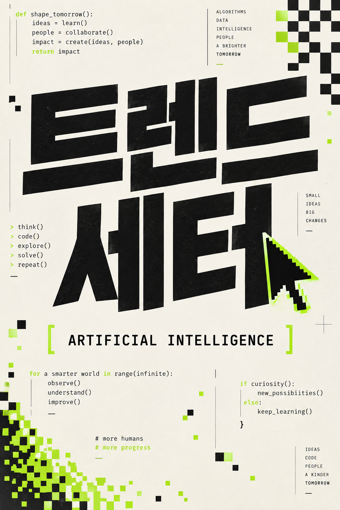

# Welcome to E26-AI01-15

## 🎯 팀 슬로건

> 트렌드 세터

## 🖼️ 팀 포스터

<div class="poster"></div>

***

## 1️⃣ 팀원 소개

| **이름** | **전공** | **관심사** |
| --- | --- | --- |
| **김광철** | 인공지능전공 | 보안, 프론트엔드 |
| **최도연** | 인공지능전공 | 보안, 프론트엔드, 인공지능 |
| **신유빈** | 인공지능전공 | 인공지능, 해외인턴 |
| **중빌릭** | 인공지능전공 | UX/UI, 모바일 앱, 인공지능  |

### 팀 소개

빠르게 변하가는 시대 속에서 앞으로 변할 시대를 주도하고자 하는 국민대학교 소융대 인공지능학과생들입니다.

***

## 2️⃣ 공통된 관심사 : 여행, 인공지능

***

## 3️⃣ 한학기 동안의 활동 내역

### 0918 TEAM MISSION 01
| **분류** | **기술** | **분류 이유** |
| --- | --- | --- |
| **실현됨** | VR기기 | 이미 상용화 된 VR기기가 많이 있고, 영상과 비슷하게 간이 VR기기를 만들 수 있다. |
| **실현됨** | 서빙 로봇 | 많은 식당에서 이용 중이므로 현재 흔히 볼 수 있다. |
| **실현됨** | 컴퓨터 펫 | 펫 뿐만 아니라 다양한 개인 컴퓨터가 생기며 많은 일들이 가능해졌다. |
| **실현됨** | 스마트폰 결제, 통신 | 현재 스마트폰 하나로 결제, 인증 등 모든게 가능해졌다. |
| **일부 실현** | 원격 의료 | 현재 가능은 하지만 너무 먼 거리에서의 지연 시간 등으로 인해 상용화가 되지 못했다. |
| **일부 실현** | 자율주행 | 테슬라와 같이 자율 주행 차들이 많이 생겼지만 아직 법적 문제 등으로 상용화가 되지 않았다. |
| **아직 미실현** | 차가 날아서 앞으로 | 모든 차가 하늘로 날아 갈 경우 필요 없는 기술이기도 하고, 현실적으로 차를 높게 띄우는게 아직 불가능 한 것 같다. |
| **방향 전환** | 태양열 자동차 | 태양열을 이용하지는 않지만, 비슷한 하이브리드 자동차가 있다. 전기를 충전 가능할 때 충전하고 전기가 없거나 힘을 쓸 땐 기존 방식대로 가는 방식이다. |

- 김광철: 확실히 실현된 건 많지만 아직 실현되지 않은 기술도 있었다. 터무니 없어 보이지만 옛날에 기술이 없던 시절에도 기발한 생각이 많은 것 같아 신기했다.
- 최도연: 예전에는 단순한 상상처럼 보였던 것들이 일부 시간이 지나며 실제 모습으로 나타난다는 점이 흥미로웠다. 기술이 발전하는 과정에는 뛰어난 발명뿐 아니라 사람들의 호기심과 끊임없는 상상이 큰역할을 한다는 것을 느꼈다.
- 중빌릭: 옛날 사람들이 생각한 미래가 생각보다 지금의 생활과 비슷해서 놀랐다. 모든 예측이 그대로 실현된 것은 아니지만, 다른 형태로 발전한 기술도 많다는 점이 재미있었다.
- 신유빈: 과거의 상상과 현실이 크게 다르지 않다는 사실이 놀라웠고, 지금 우리가 상상하는 것 또한 미래에는 실현될 거라는 생각에 기대가 되었다. 한편으로는 그 이면에 있었던 과정을 떠올리며 기술의 발전에는 이를 향한 의지와 노력이 동반된다는 것을 느꼈다. 


- 기관/부서 인터뷰 ✔️  

- 현장 탐방 ✔️  

- 멘토링 ✔️  
  - 내 지도 교수 함게 만나기
  - 대학원 방문 및 선배 만나기

- 프로젝트 진행 ✔️  
  - 과거에 사람들이 상상한 미래
  - 그들이 만들어가는 세상
  - 우리가 상상한 미래
  - 우리가 그리는 미래 그리고 나

- 각오와 소감 나누기 ✔️  


<!-- 활동 사진 추가 예시 -->


***

## 4️⃣ 인상 깊은 활동

- 활동명 – 활동에 대한 간단한 설명과 배운 점을 작성  
- 예: 멘토링에서 실리콘밸리 현업 경험을 들을 수 있어 진로 방향 설정에 큰 도움이 되었다.  

***

## 5️⃣ 특별히 알아보고 싶은 것
- 예: 현장실습 제도
- 예: 학부 졸업 인증 조건
- 예: 성취기반평가
- 예: 졸업 후 진로(대학원/취업)

***

## 6️⃣ 활동을 마친 소감

🔗학번 이름  
> "소감 내용을 여기에 작성합니다."

🔗학번 이름  
> "소감 내용을 여기에 작성합니다."

🔗학번 이름  
> "소감 내용을 여기에 작성합니다."

🔗학번 이름  
> "소감 내용을 여기에 작성합니다."

🔗학번 이름  
> "소감 내용을 여기에 작성합니다."


## Markdown을 사용하여 내용꾸미기를 익히세요.

Markdown은 작문을 스타일링하기위한 가볍고 사용하기 쉬운 구문입니다. 여기에는 다음을위한 규칙이 포함됩니다.

```markdown
Syntax highlighted code block

# Header 1
## Header 2
### Header 3

- Bulleted
- List

1. Numbered
2. List

**Bold** and _Italic_ and `Code` text

[Link](url) and 
```

자세한 내용은 [GitHub Flavored Markdown](https://guides.github.com/features/mastering-markdown/).

### Support or Contact

readme 파일 생성에 추가적인 도움이 필요하면 [도움말](https://help.github.com/articles/about-readmes/) 이나 [contact support](https://github.com/contact) 을 이용하세요.

