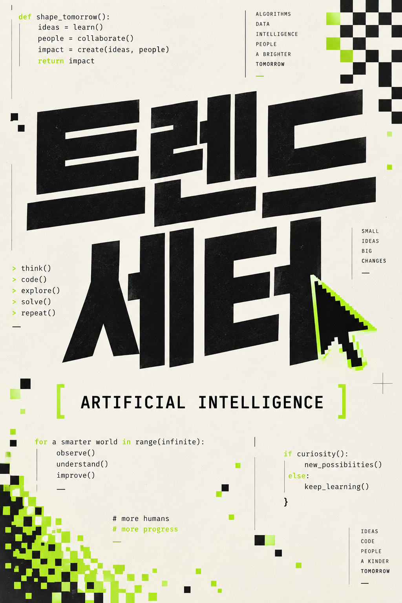

# Welcome to E26-AI01-15

## 🎯 팀 슬로건

> 트렌드 세터

## 🖼️ 팀 포스터

<div class="poster"></div>

***

## 1️⃣ 팀원 소개

| **이름** | **전공** | **관심사** |
| --- | --- | --- |
| **김광철** | 인공지능전공 | 보안, 프론트엔드 |
| **최도연** | 인공지능전공 | 보안, 프론트엔드, 인공지능 |
| **신유빈** | 인공지능전공 | 인공지능, 해외인턴 |
| **중빌릭** | 인공지능전공 | UX/UI, 모바일 앱, 인공지능  |

### 팀 소개

빠르게 변하가는 시대 속에서 앞으로 변할 시대를 주도하고자 하는 국민대학교 소융대 인공지능학과생들입니다.

***

## 2️⃣ 공통된 관심사 : 여행, 인공지능

***

## 3️⃣ 한학기 동안의 활동 내역

### 0918 TEAM MISSION 01
| **분류** | **기술** | **분류 이유** |
| --- | --- | --- |
| **실현됨** | VR기기 | 이미 상용화 된 VR기기가 많이 있고, 영상과 비슷하게 간이 VR기기를 만들 수 있다. |
| **실현됨** | 서빙 로봇 | 많은 식당에서 이용 중이므로 현재 흔히 볼 수 있다. |
| **실현됨** | 컴퓨터 펫 | 펫 뿐만 아니라 다양한 개인 컴퓨터가 생기며 많은 일들이 가능해졌다. |
| **실현됨** | 스마트폰 결제, 통신 | 현재 스마트폰 하나로 결제, 인증 등 모든게 가능해졌다. |
| **일부 실현** | 원격 의료 | 현재 가능은 하지만 너무 먼 거리에서의 지연 시간 등으로 인해 상용화가 되지 못했다. |
| **일부 실현** | 자율주행 | 테슬라와 같이 자율 주행 차들이 많이 생겼지만 아직 법적 문제 등으로 상용화가 되지 않았다. |
| **아직 미실현** | 차가 날아서 앞으로 | 모든 차가 하늘로 날아 갈 경우 필요 없는 기술이기도 하고, 현실적으로 차를 높게 띄우는게 아직 불가능 한 것 같다. |
| **방향 전환** | 태양열 자동차 | 태양열을 이용하지는 않지만, 비슷한 하이브리드 자동차가 있다. 전기를 충전 가능할 때 충전하고 전기가 없거나 힘을 쓸 땐 기존 방식대로 가는 방식이다. |

- 김광철: 확실히 실현된 건 많지만 아직 실현되지 않은 기술도 있었다. 터무니 없어 보이지만 옛날에 기술이 없던 시절에도 기발한 생각이 많은 것 같아 신기했다.
- 최도연: 예전에는 단순한 상상처럼 보였던 것들이 일부 시간이 지나며 실제 모습으로 나타난다는 점이 흥미로웠다. 기술이 발전하는 과정에는 뛰어난 발명뿐 아니라 사람들의 호기심과 끊임없는 상상이 큰역할을 한다는 것을 느꼈다.
- 중빌릭: 옛날 사람들이 생각한 미래가 생각보다 지금의 생활과 비슷해서 놀랐다. 모든 예측이 그대로 실현된 것은 아니지만, 다른 형태로 발전한 기술도 많다는 점이 재미있었다.
- 신유빈: 과거의 상상과 현실이 크게 다르지 않다는 사실이 놀라웠고, 지금 우리가 상상하는 것 또한 미래에는 실현될 거라는 생각에 기대가 되었다. 한편으로는 그 이면에 있었던 과정을 떠올리며 기술의 발전에는 이를 향한 의지와 노력이 동반된다는 것을 느꼈다. 

### 교내 문제 발견 및 해결 아이디어

학교생활에서 겪는 불편함을 찾아보고, 해결 아이디어를 필요성(Why), 새로움(Novelty), 실현 가능성(How), 위험 요소(Risk)의 관점에서 정리하였다.

#### 신유빈 — 셔틀버스 대기 인원 및 탑승 가능성 안내

**문제점**

셔틀버스의 대기 인원을 알 수 없어 혼잡한 시간대에 탑승하지 못하는 상황이 발생함.

| **평가 항목** | **내용** |
| --- | --- |
| **필요성 (Why)** | 대기 인원과 탑승 가능 여부를 알 수 없어 발생하는 불필요한 대기와 탑승 실패 경험을 줄일 필요가 있음. |
| **새로움 (Novelty)** | 단순한 버스 도착 정보가 아니라 실시간 대기 인원·혼잡도·탑승 가능성을 제공함. |
| **실현 가능성 (How)** | QR 체크인, GPS, 탑승 데이터 등을 활용해 단계적으로 구현할 수 있음. |
| **위험 요소 (Risk)** | 데이터 부정확성, 개인정보 보호, 예측 오차, 낮은 사용자 참여율 등의 문제가 발생할 수 있음. |

#### 중빌릭 — 신입생을 위한 동아리 및 학교 활동 추천

**문제점**

신입생은 동아리, 학교 행사, 비교과 프로그램 등의 정보를 잘 알지 못해 다양한 활동에 참여할 기회를 놓칠 수 있음.

| **평가 항목** | **내용** |
| --- | --- |
| **필요성 (Why)** | 신입생이 학교 활동 정보를 쉽게 찾고 자신에게 맞는 활동에 참여할 수 있도록 지원할 필요가 있음. |
| **새로움 (Novelty)** | 단순히 학교 활동 정보를 제공하는 것이 아니라, 학생의 관심사와 일정 등을 고려하여 자신에게 맞는 활동을 추천함. |
| **실현 가능성 (How)** | 학교 홈페이지, 동아리 모집 공지, 비교과 프로그램 등의 정보를 활용하여 AI 기반 추천 서비스로 구현할 수 있음. |
| **위험 요소 (Risk)** | 모집 기간이 지난 정보가 제공되거나 정보가 변경될 가능성이 있으며, 개인정보 수집에 대한 주의가 필요함. |

#### 김광철 — 종착점 버스의 출발 준비 상태 안내

**문제점**

종착점에 있는 버스의 다음 출발이 언제인지 알 수 없음.

**해결 아이디어**

기사 또는 배차 담당자의 출발 준비 신호를 승객에게 제공함.

| **평가 항목** | **내용** |
| --- | --- |
| **필요성 (Why)** | 시스템에 잡히지 않는 현장 상황을 승객에게 빠르게 전달할 필요가 있음. |
| **새로움 (Novelty)** | 중간. 승객에게 ‘출발 준비 중’ 상태를 제공함. |
| **실현 가능성 (How)** | 중간~높음. 정차 중 단말기에서 상태를 선택하도록 구현할 수 있음. 가능하면 배차 담당자가 입력하거나 기존 업무에 통합함. |
| **위험 요소 (Risk)** | 입력 누락, 추가 업무 부담, 준비 신호 이후 출발 지연이 발생할 수 있음. 운전 중 조작이 발생하지 않도록 설계할 필요가 있음. |

#### 최도연 — 미래관 통유리 건물의 실내 열 유입 조절

**문제점**

미래관의 통유리 구조로 인해 실내가 너무 더워지는 문제가 있음.

| **평가 항목** | **내용** |
| --- | --- |
| **필요성 (Why)** | 통유리 건물은 햇빛이 넓은 면적으로 실내에 들어오기 때문에 실내 온도가 쉽게 올라감. 특히 여름철에는 냉방을 많이 사용해야 해서 전기 사용량과 냉방비가 증가하고, 건물 이용자도 더위와 불쾌감을 느낄 수 있음. |
| **새로움 (Novelty)** | 유리의 특성을 활용하면서도 과도한 열 유입을 줄이는 방법을 찾는다는 점에 의미가 있음. 스마트 글라스, 외부 차양, 열 차단 필름 등을 결합해 건물의 개방감을 유지하면서 열 문제를 해결할 수 있음. |
| **실현 가능성 (How)** | ① 태양의 위치와 일사량을 측정하고 ② 실내 온도와 유리 표면 온도를 측정한 뒤 ③ 자동 블라인드·차양·스마트 글라스 등을 이용해 들어오는 햇빛의 양을 조절함. 이후 실내 온도 변화와 냉방 에너지 사용량을 비교해 효과를 확인함. |
| **위험 요소 (Risk)** | 차양이나 블라인드를 과도하게 사용하면 자연채광이 줄어들고 건물의 개방감이 떨어질 수 있음. 스마트 글라스나 자동 차양 시스템은 초기 설치 비용이 높고, 센서나 제어 시스템의 고장 가능성도 있음. |

### 최종 선택 아이디어 및 선정 이유

**최종 선택 아이디어: 셔틀버스 대기 인원 및 탑승 가능성 안내**

셔틀버스의 실시간 대기 인원과 혼잡도, 탑승 가능성을 제공하여 학생들이 이용 시간과 탑승 여부를 판단할 수 있도록 돕는 서비스이다.

**선정 이유**

- **학생들이 체감하는 불편 해결:** 혼잡한 시간대에 오래 기다리고도 탑승하지 못하는 문제를 해결하여 불필요한 대기와 시간 낭비를 줄일 수 있다.
- **기존 버스 정보와의 차별성:** 버스의 위치나 도착 시간뿐 아니라 대기 인원과 탑승 가능성까지 제공하여 실제 이용 판단에 도움을 줄 수 있다.
- **단계적인 구현 가능성:** 초기에는 QR 체크인을 활용한 대기 인원 안내부터 시작하고, 이후 GPS와 탑승 데이터를 연계해 혼잡도 및 탑승 가능성 예측으로 확장할 수 있다.
- **효과 확인의 용이성:** 서비스 도입 전후의 대기 시간, 탑승 실패 경험, 이용자 만족도를 비교하여 효과를 확인할 수 있다.

다만 QR 체크인 참여율과 데이터 정확도가 서비스의 신뢰도에 영향을 줄 수 있으므로, 초기에는 소규모 시범 운영을 통해 실제 대기 인원과의 차이를 확인하고 보완할 계획이다.


- 기관/부서 인터뷰 ✔️  

- 현장 탐방 ✔️  

- 멘토링 ✔️  
  - 내 지도 교수 함게 만나기
  - 대학원 방문 및 선배 만나기

- 프로젝트 진행 ✔️  
  - 과거에 사람들이 상상한 미래
  - 그들이 만들어가는 세상
  - 우리가 상상한 미래
  - 우리가 그리는 미래 그리고 나

- 각오와 소감 나누기 ✔️  


<!-- 활동 사진 추가 예시 -->


***

## 4️⃣ 인상 깊은 활동

- 활동명 – 활동에 대한 간단한 설명과 배운 점을 작성  
- 예: 멘토링에서 실리콘밸리 현업 경험을 들을 수 있어 진로 방향 설정에 큰 도움이 되었다.  

***

## 5️⃣ 특별히 알아보고 싶은 것
- 예: 현장실습 제도
- 예: 학부 졸업 인증 조건
- 예: 성취기반평가
- 예: 졸업 후 진로(대학원/취업)

***

## 6️⃣ 활동을 마친 소감

🔗학번 이름  
> "소감 내용을 여기에 작성합니다."

🔗학번 이름  
> "소감 내용을 여기에 작성합니다."

🔗학번 이름  
> "소감 내용을 여기에 작성합니다."

🔗학번 이름  
> "소감 내용을 여기에 작성합니다."

🔗학번 이름  
> "소감 내용을 여기에 작성합니다."


## Markdown을 사용하여 내용꾸미기를 익히세요.

Markdown은 작문을 스타일링하기위한 가볍고 사용하기 쉬운 구문입니다. 여기에는 다음을위한 규칙이 포함됩니다.

```markdown
Syntax highlighted code block

# Header 1
## Header 2
### Header 3

- Bulleted
- List

1. Numbered
2. List

**Bold** and _Italic_ and `Code` text

[Link](url) and 
```

자세한 내용은 [GitHub Flavored Markdown](https://guides.github.com/features/mastering-markdown/).

### Support or Contact

readme 파일 생성에 추가적인 도움이 필요하면 [도움말](https://help.github.com/articles/about-readmes/) 이나 [contact support](https://github.com/contact) 을 이용하세요.